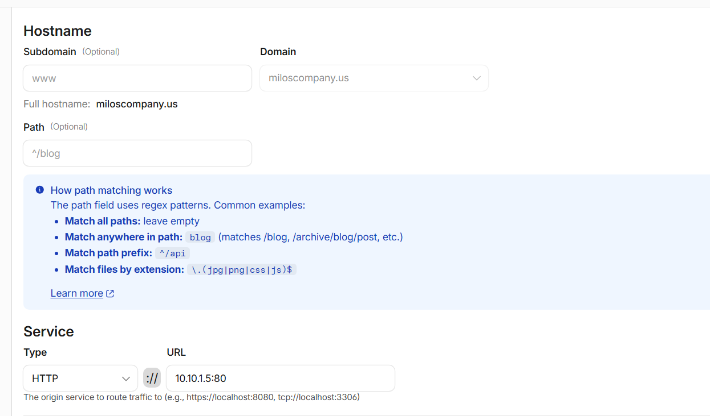

# NGINX Reverse Proxy & Cloudflare Tunnel Integration

## 1. Overview & Architecture Role

In this architecture, NGINX runs on host `10.10.1.5` as an internal **Reverse Proxy**. Its role is to receive requests from the Cloudflare Tunnel and forward them to the Node.js application running on `10.10.1.7:3000`.

TLS termination is handled at the Cloudflare edge. The Cloudflare Tunnel forwards traffic to the local NGINX instance over HTTP, so no local TLS certificate is required on NGINX for this configuration.

---

## 2. NGINX Site Configuration (`/etc/nginx/sites-available/milos`)

Configuration stored at `/etc/nginx/sites-available/milos`:

```nginx
server {
    listen 80;
    server_name miloscompany.us;

    location / {
        proxy_pass http://10.10.1.7:3000;

        proxy_set_header X-Real-IP $http_cf_connecting_ip;
        proxy_set_header X-Forwarded-For $http_cf_connecting_ip;
        proxy_set_header X-Forwarded-Proto $scheme;
    }
}

```

### Configuration Breakdown

* **`listen 80`**: Listens for HTTP traffic coming from the local Cloudflare Tunnel connector.
* **`server_name miloscompany.us`**: Binds the proxy configuration to requests targeting the public domain.
* **`proxy_pass http://10.10.1.7:3000`**: Forwards all traffic to the Node.js web server inside the DMZ.
* **`proxy_set_header X-Real-IP $http_cf_connecting_ip`**: Uses the CF-Connecting-IP header provided by Cloudflare to pass the original client IP address to the backend application for logging and security monitoring.

---

## 3. Enable Site Configuration (Symbolic Link)

To enable the site, create a symbolic link from `sites-available` to `sites-enabled`:

```bash
# Create symbolic link to activate configuration
sudo ln -s /etc/nginx/sites-available/milos /etc/nginx/sites-enabled/

# Remove default NGINX site if present
sudo rm -f /etc/nginx/sites-enabled/default

# Verify configuration syntax
sudo nginx -t

# Reload NGINX service to apply settings
sudo systemctl reload nginx

```

---

## 4. Cloudflare Zero Trust Tunnel Setup

Public access is established using Cloudflare Zero Trust Tunnels, eliminating the need to expose inbound web ports on the perimeter firewall.

### Workflow & Deployment Steps

1. **Cloudflared Installation:** The official `cloudflared` package repository was added to the server (`10.10.1.5`), followed by installing the `cloudflared` daemon.
2. **Domain Acquisition:** The custom domain `miloscompany.us` was registered and configured within Cloudflare dashboard.
3. **Zero Trust Integration:** Navigated to **Cloudflare Zero Trust** -> **Networks** -> **Tunnels** and created a new tunnel instance.
4. **Service Installation:** Executed the service installation command provided by Cloudflare:
```bash
sudo cloudflared service install <TUNNEL_TOKEN>

```


5. **Public Hostname Mapping:** Configured the tunnel routing rule to direct public domain traffic to the local NGINX proxy:




