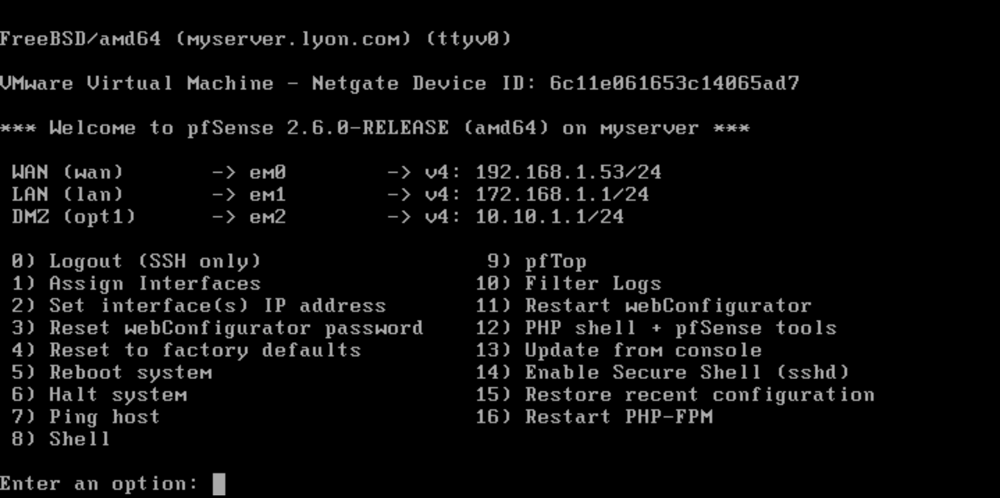
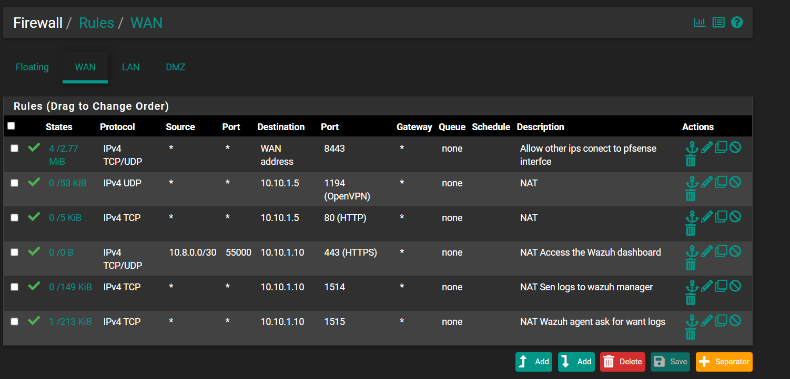
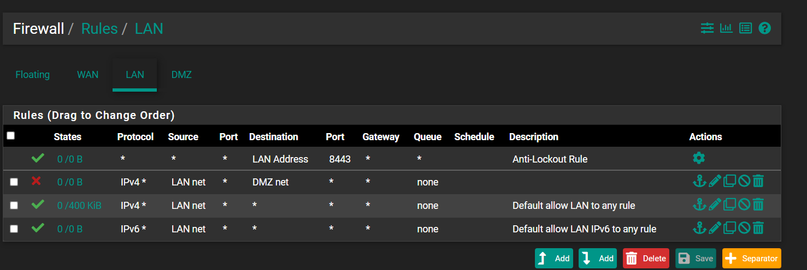
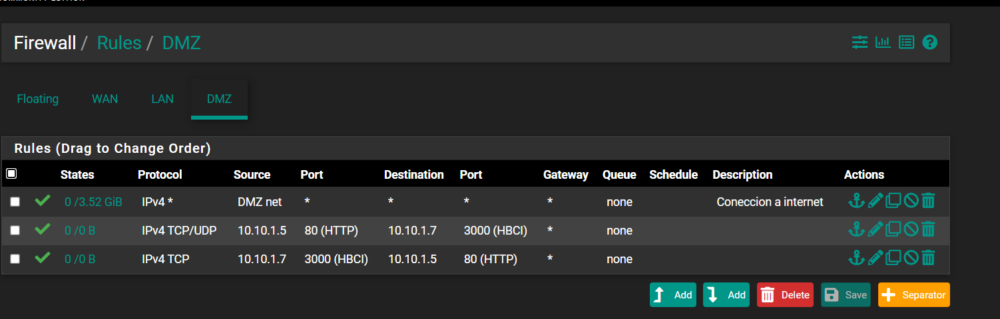

# pfSense Firewall Configuration & Security Policies

## 1. Interface Assignments & Network Architecture

### Interface Roles & Network Purpose

* **WAN Interface (`em0` - `192.168.1.53/24`):** Connects the firewall to the external network (`192.168.1.0/24`). It acts as the perimeter barrier that receives incoming traffic, handles Port Forwarding (NAT), and blocks unauthorized external access into internal zones.
* **LAN Interface (`em1` - `172.168.1.1/24`):** Connects the internal administrative network. This isolated area hosts operator workstations (`LAP SIS`) used for managing the lab and running security tests safely without exposing management traffic to public zones.
* **DMZ Interface (`em2` - `10.10.1.1/24`):** Establishes an isolated zone for public-facing services, including the NGINX Reverse Proxy (`10.10.1.5`), Web Server (`10.10.1.7`), and Wazuh SIEM (`10.10.1.10`). Isolating these hosts ensures that if a public service is compromised, an attacker cannot easily reach the internal LAN network.

---

## 2. Network Address Translation (NAT) & Port Forwarding

Port Forwarding rules direct external traffic arriving at the WAN IP (`192.168.1.53`) to specific internal services inside the DMZ without exposing the internal servers directly to the external network.

### NAT Rules Breakdown & Purpose

* **HTTP Web Access (`WAN TCP 80 -> 10.10.1.5:80`):** Forwards external web requests to the NGINX Reverse Proxy (`10.10.1.5`). NGINX handles SSL termination and proxying before passing traffic to internal web applications.
* **OpenVPN Remote Access (`WAN UDP 1194 -> 10.10.1.5:1194`):** Routes encrypted VPN traffic to the OpenVPN server on `10.10.1.5`, allowing secure remote connections into the lab environment.
* **Wazuh Dashboard Protection (`WAN TCP/UDP 55000 -> 10.10.1.10:443`):** Maps external port `55000` to the Wazuh HTTPS interface (`443`) on `10.10.1.10`. Access is strictly limited to the VPN subnet (`10.8.0.0/30`) to keep the SIEM management dashboard private.
* **Wazuh Agent Log Traffic (`WAN TCP 1514 -> 10.10.1.10:1514`):** Directs incoming log data, File Integrity Monitoring (FIM) events, and command tracking logs from external Wazuh agents to the Wazuh Manager.
* **Wazuh Agent Registration (`WAN TCP 1515 -> 10.10.1.10:1515`):** Allows new external Wazuh agents to register automatically with the central manager using secure key exchange.

---

## 3. WAN Rules (Ingress Firewall Rules)

WAN rules control inbound network traffic passing through the external interface (`192.168.1.53`). In pfSense, active NAT rules automatically generate linked pass rules.

### Inbound Rules Explanation

* **pfSense Web Management (`IPv4 TCP/UDP * -> WAN address:8443`):** Allows administrative connection to the pfSense WebGUI on port `8443` from external management machines.
* **OpenVPN Traffic (`IPv4 UDP * -> 10.10.1.5:1194`):** Linked NAT rule allowing remote clients to establish OpenVPN tunnels with the VPN server in the DMZ.
* **HTTP Proxy Traffic (`IPv4 TCP * -> 10.10.1.5:80`):** Linked NAT rule allowing public web traffic to reach the NGINX Reverse Proxy.
* **Restricted SOC Dashboard (`IPv4 TCP/UDP 10.8.0.0/30:55000 -> 10.10.1.10:443`):** Allows access to the Wazuh Dashboard exclusively for authenticated users connected via the `10.8.0.0/30` VPN network.
* **Wazuh Telemetry Ingress (`IPv4 TCP * -> 10.10.1.10:1514`):** Linked NAT rule permitting external Wazuh agents to send real-time logs to the manager.
* **Wazuh Agent Enrollment (`IPv4 TCP * -> 10.10.1.10:1515`):** Linked NAT rule permitting new agents to connect and register on port `1515`.

---

## 4. LAN Rules (Internal Network Controls)

LAN rules manage outgoing traffic from trusted internal workstations (`172.168.1.0/24`) and define network access policies.

### LAN Rules Explanation

* **Anti-Lockout Rule (`* * -> LAN Address:8443`):** Built-in pfSense protection rule ensuring administrators always have access to the web firewall GUI on port `8443`.
* **DMZ Access Control (`IPv4 * LAN net -> DMZ net`):** Disabled to prevent direct traffic from internal operator workstations to DMZ servers. This forces access to be handled through explicitly defined security policies.
* **Default IPv4 Internet Access (`IPv4 * LAN net -> *`):** Standard rule allowing workstations on the LAN subnet to access internet resources for updates and software installations.
* **Default IPv6 Internet Access (`IPv6 * LAN net -> *`):** Standard rule permitting outbound IPv6 internet traffic for LAN hosts.

---

## 5. DMZ Rules (Demilitarized Zone Controls)

DMZ rules regulate traffic originating from servers in the `10.10.1.0/24` subnet to prevent lateral movement and isolate services.

### DMZ Rules Explanation

* **Outbound Internet Access (`IPv4 * DMZ net -> *`):** Allows DMZ servers to reach the internet for system updates, package installation, and external API requests (such as VirusTotal checks).
* **Proxy to Web App Backend (`IPv4 TCP/UDP 10.10.1.5:80 -> 10.10.1.7:3000`):** Allows the NGINX Reverse Proxy (`10.10.1.5`) to forward web traffic to the Node.js application running on port `3000` (`HBCI`) on server `10.10.1.7`.
* **Web App Response to Proxy (`IPv4 TCP 10.10.1.7:3000 -> 10.10.1.5:80`):** Allows the Node.js web server (`10.10.1.7`) to send HTTP responses back to the NGINX Reverse Proxy (`10.10.1.5`) to complete web requests.