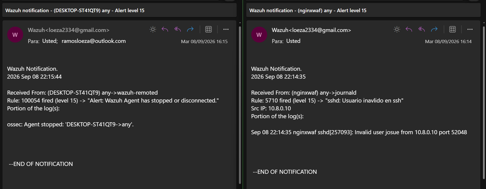

# Wazuh Server Architecture & General Detection Rules

## 1. Overview & Setup Prerequisites

The Wazuh Manager is deployed on host `10.10.1.10` within the DMZ segment, serving as the central SIEM platform for the infrastructure.

The core installation was executed following the official Wazuh documentation guidelines, with configuration adjustments made specifically to align system IP addressing, agent connectivity settings, and local network routes with the laboratory topology.

This document details the general custom detection rules and email notification setup configured on the Wazuh Manager. To ensure maintainability and prevent changes from being overwritten during system updates, all custom detection rules and overrides are implemented directly inside the user-defined `/var/ossec/etc/rules/local_rules.xml` file rather than modifying default rulesets.

---

## 2. SMTP Relay & Email Notification Setup

To enable real-time security alert dispatch via email, an SMTP Relay server was deployed on the Wazuh Manager host using Postfix following standard Wazuh integration procedures.

### Manager Global Email Configuration (`/var/ossec/etc/ossec.conf`)

The global configuration file was updated to route alerts through the local Postfix service, defining alert thresholds and targeted notification rules:

```xml
<ossec_config>
  <global>
    <jsonout_output>yes</jsonout_output>
    <alerts_log>yes</alerts_log>
    <logall>no</logall>
    <logall_json>no</logall_json>
    <email_notification>yes</email_notification>
    <smtp_server>localhost</smtp_server>
    <email_from>loeza2334@gmail.com</email_from>
    <email_to>ramosloeza@outlook.com</email_to>
    <email_maxperhour>12</email_maxperhour>
    <email_log_source>alerts.log</email_log_source>
    <agents_disconnection_time>15m</agents_disconnection_time>
    <agents_disconnection_alert_time>0</agents_disconnection_alert_time>
    <update_check>yes</update_check>
  </global>

  <email_alerts>
    <email_to>ramosloeza@outlook.com</email_to>
    <level>10</level>
    <rule_id>100054</rule_id>
    <do_not_delay/>
  </email_alerts>

  <alerts>
    <log_alert_level>3</log_alert_level>
    <email_alert_level>12</email_alert_level>
  </alerts>
</ossec_config>

```

### Key Directives Rationale

* **`<email_notification>yes` / `<smtp_server>localhost`:** Enables email functionality and binds alert delivery to the local Postfix SMTP relay service.
* **`<email_maxperhour>12`:** Implements rate-limiting to prevent inbox flooding during high-volume security incidents or brute-force testing.
* **`<email_alert_level>12`:** Sets the baseline threshold for automated emails to high-severity events (Level 12+).
* **`<email_alerts>` block:** Defines explicit override policies to trigger immediate emails without delay (`<do_not_delay/>`) for specific critical events, such as rule `100054` (Agent Disconnection) or any alert reaching level `10`.

---

## 3. Custom General Detection Rules (`/var/ossec/etc/rules/local_rules.xml`)

The following rules were configured inside `local_rules.xml` to customize default behaviors, escalate critical system events, and track SSH authentication anomalies:

```xml
<group name="syslog,sshd,">
  <rule id="5710" level="15" frequency="4" timeframe="180" ignore="60" overwrite="yes">
    <if_matched_sid>5710</if_matched_sid>
    <if_sid>5700</if_sid>
    <match>illegal user|invalid user</match>
    <description>sshd: Usuario inavlido en ssh</description>
    <mitre>
      <id>T1110</id>
    </mitre>
    <group>invalid_login,authentication_failed,pci_dss_10.2.4,pci_dss_10.2.5,pci_dss_10.6.1,gpg13_7.1,gdpr_IV_35.7.d,gdpr_IV_32.2,hipaa_164.312.b,nist_800_53_AU.14,nist_800_53_AC.7</group>
  </rule>
</group>

<group name="local,ossec,">
  <!-- Send an email when a new agent connects / starts running -->
  <rule id="100051" level="5">
    <if_sid>501,503</if_sid>
    <options>alert_by_email</options>
    <description>Wazuh Agent is now running and active.</description>
  </rule>

  <!-- Send an email when an agent stops or goes offline -->
  <rule id="100054" level="15">
    <if_sid>504,506</if_sid>
    <options>alert_by_email</options>
    <description>Alert: Wazuh Agent has stopped or disconnected.</description>
  </rule>
</group>

```

### Detailed Breakdown of Custom Rules

* **Rule `5710` (Level 15 - Overridden Default SSH Rule):** Uses `overwrite="yes"` to replace default Wazuh rule `5710`.
* **Threshold:** Triggers when 4 invalid user attempts (`frequency="4"`) occur within 180 seconds (`timeframe="180"`).
* **Severity & Mitigation:** Escalates severity directly to **Level 15** (Maximum Criticality) and maps to **MITRE ATT&CK T1110 (Brute Force)**.
* **Ignored Interval:** Suppresses duplicate notifications for 60 seconds (`ignore="60"`) after firing to prevent alert flooding.


* **Rule `100051` (Level 5 - Agent Active Notification):** Monitors parent events `501` and `503` (agent startup/reconnection). Uses `<options>alert_by_email</options>` to force an immediate informational notification upon agent activation.
* **Rule `100054` (Level 15 - Agent Disconnection Alert):** Intercepts parent events `504` and `506` (agent disconnects or stops). Escalates the event to **Level 15** to reflect potential agent tampering, system outages, or network disruption, forcing an instant email alert to the analyst.

---

## 4. Verification & Email Notification Validation

To confirm the operational readiness of the email alerting framework and rule overrides, real-world events were simulated across endpoints.

### Real-Time Email Alerts Capture

Below are two live email notifications dispatched by the Wazuh Manager to `ramosloeza@outlook.com` via Postfix:



1. **Critical Endpoint Offline Event (Rule `100054`):** Captures an agent disconnection event on endpoint `DESKTOP-ST41QT9`. The system triggered a Level 15 email alert immediately upon service shutdown.
2. **Invalid SSH User Attempt (Rule `5710`):** Captures an unauthorized SSH attempt targeting user `josue` on endpoint `nginxwaf` originating from client IP `10.8.0.10` over the OpenVPN interface.

**Event 1: Agent Disconnection Alert**

* **Subject:** Wazuh notification - (DESKTOP-ST41QT9) any - Alert level 15
* **From:** Wazuh [loeza2334@gmail.com](https://www.google.com/search?q=mailto%3Aloeza2334%40gmail.com)
* **Log:** Rule: 100054 fired (level 15) -> "Alert: Wazuh Agent has stopped or disconnected."
* **Details:** ossec: Agent stopped: 'DESKTOP-ST41QT9->any'.

**Event 2: Invalid SSH Login Attempt**

* **Subject:** Wazuh notification - (nginxwaf) any - Alert level 15
* **From:** Wazuh [loeza2334@gmail.com](https://www.google.com/search?q=mailto%3Aloeza2334%40gmail.com)
* **Log:** Rule: 5710 fired (level 15) -> "sshd: Usuario inavlido en ssh"
* **Details:** Sep 08 22:14:35 nginxwaf sshd[257093]: Invalid user josue from 10.8.0.10 port 52048