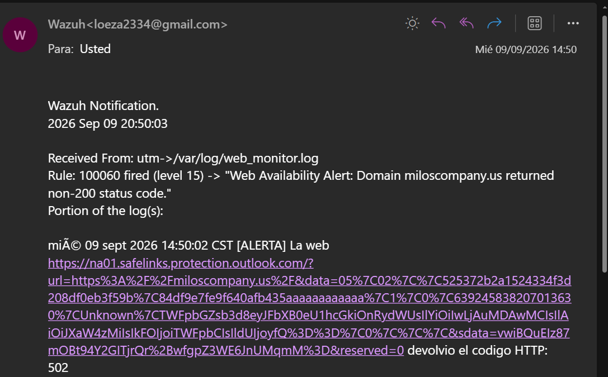

# Wazuh Server Command Monitoring

## Overview

At first, I used Wazuh's command monitoring feature (`full_command`) in `ossec.conf` to check if `[https://miloscompany.us]` was running. It worked, but running curl directly inside the Wazuh agent wasn't very efficient and made it harder to manage log formats.

To fix this, I changed the strategy: I created a simple Bash script that runs in the background using `cron`. The script checks the website status and writes any errors to a custom log file (`/var/log/web_monitor.log`). Then, the Wazuh agent just reads that file. This keeps the setup clean and easy to maintain.

---

## 1. Web Check Script & Cron Setup

The script checks the HTTP response code of `[https://miloscompany.us](https://miloscompany.us)`. If the site gives any code other than `200 OK`, it saves an alert message in `/var/log/web_monitor.log`.

**Script file (`/var/ossec/scripts/check_web.sh`):**

```bash
#!/bin/bash
URL="https://miloscompany.us"
STATUS=$(curl -s -o /dev/null -w "%{http_code}" $URL)

if [ "$STATUS" -ne 200 ]; then
    echo "$(date) [ALERTA] La web $URL devolvio el codigo HTTP: $STATUS" >> /var/log/web_monitor.log
fi

```

**Automated execution with Cron:**

To run this check automatically every 5 minutes, I added this line to `crontab`:

```bash
# m h dom mon dow command
*/5 * * * * /var/ossec/scripts/check_web.sh

```

---

## 2. Wazuh Agent Log Configuration (`/var/ossec/etc/ossec.conf`)

To capture the output from our script, we instruct the Wazuh agent to monitor the custom log file in real time. We added a `<localfile>` block inside the agent's `/var/ossec/etc/ossec.conf` file:

```xml
<ossec_config>
  <localfile>
    <log_format>syslog</log_format>
    <location>/var/log/web_monitor.log</location>
  </localfile>
</ossec_config>

```

* **`<localfile>`:** Tells the agent to monitor a specific log file on the endpoint.
* **`<log_format>syslog</log_format>:`** Reads each line as a standard single-line text entry.
* **`<location>/var/log/web_monitor.log`:** Specifies the exact file path where our script writes non-200 HTTP responses.

---

## 3. Custom Detection Rule (`/var/ossec/etc/rules/local_rules.xml`)

When the agent sends new log entries to the Manager, custom rule `100060` parses the file and triggers a critical alert if an error is logged:

```xml
<group name="web_monitoring,">
  <rule id="100060" level="15">
    <location>/var/log/web_monitor.log</location>
    <match>ALERTA</match>
    <options>alert_by_email</options>
    <description>Web Availability Alert: Domain miloscompany.us returned non-200 status code.</description>
    <group>service_availability,web_status,</group>
  </rule>
</group>

```

**How the Rule Works:**

* **`id="100060"` & `level="15"`:** Uses a custom ID in the user-defined range (`100000+`) and sets severity to Level 15 (Critical) because web downtime is a high-priority incident.
* **`<location>` & `<match>`:** Ensures the rule only evaluates `/var/log/web_monitor.log` and only fires when it detects the keyword `ALERTA`.
* **`<options>alert_by_email</options>`:** Forces Wazuh to send an instant email notification without delay whenever web availability fails.

---

## 4. Live Email Alert Verification

When the website goes down or returns an error code (like HTTP 502 Bad Gateway), the script writes the event to the log file, and Wazuh sends a real-time email notification.



**Live Email Capture:**

* **Subject:** Wazuh notification - (utm) any - Alert level 15
* **From:** Wazuh `<loeza2334@gmail.com>`
* **Rule Fired:** Rule `100060` (Level 15) -> *"Web Availability Alert: Domain miloscompany.us returned non-200 status code."*
* **Log Detail:** `mié 09 sept 2026 14:50:02 CST [ALERTA] La web [https://miloscompany.us](https://miloscompany.us) devolvio el codigo HTTP: 502`