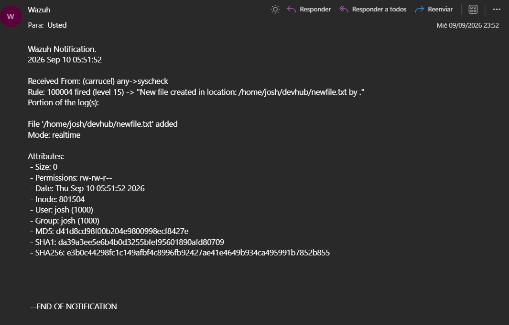
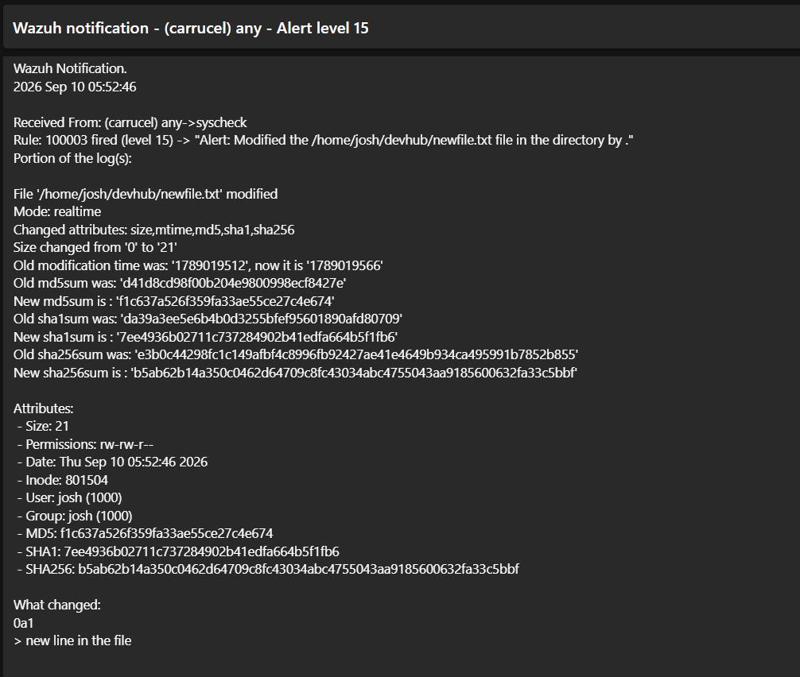
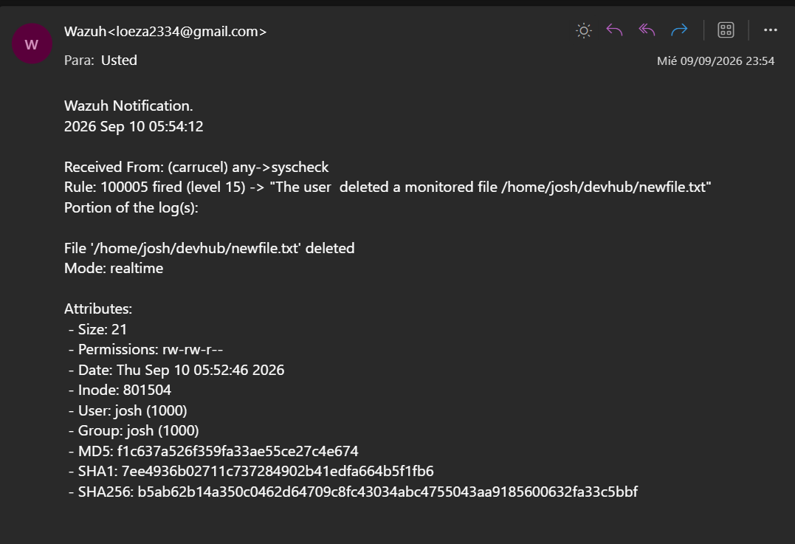

# File Integrity Monitoring (FIM) Configuration

## 1. Overview & Module Scope

File Integrity Monitoring (FIM) in Wazuh tracks changes to critical files and directories across monitored endpoints in real time. It detects unauthorized file modifications, creations, deletions, and permission changes.

In this setup, the server handles alert evaluation and email notifications. Custom detection rules are defined on the Wazuh Manager side inside a dedicated custom rules file (`/var/ossec/etc/rules/fim_rules.xml`), while specific directory paths and scan options are configured directly on the individual agent endpoints.

---

## 2. Wazuh Manager Custom Rules (`/var/ossec/etc/rules/fim_rules.xml`)

Instead of using default rules, custom rules were created to escalate FIM events to **Level 15** (Critical) and force instant email alerts when files inside monitored web application directories (like `/home/josh/devhub/`) are altered.

```xml
<group name="syscheck">
  <rule id="100002" level="15">
    <if_sid>550</if_sid>
    <field name="file">.sh$</field>
    <field name="changed_fields">^permission$</field>
    <field name="perm" type="pcre2">\w\wx</field>
    <options>alert_by_email</options>
    <description>Execute permission added to shell script.</description>
    <mitre>
      <id>T1222.002</id>
    </mitre>
  </rule>
</group>

<group name="syscheck">
  <rule id="100003" level="15">
    <if_sid>550</if_sid>
    <options>alert_by_email</options>
    <description>Alert: Modified the $(file) file in the directory by $(user_name).</description>
  </rule>
</group>

<group name="syscheck">
  <rule id="100004" level="15">
    <if_sid>554</if_sid>
    <options>alert_by_email</options>
    <description>New file created in location: $(file) by $(user_name).</description>
  </rule>
</group>

<group name="syscheck">
  <rule id="100005" level="15">
    <if_sid>553</if_sid>
    <options>alert_by_email</options>
    <description>The user $(user_name) deleted a monitored file $(file)</description>
    <mitre>
      <id>T1070.004</id>
    </mitre>
  </rule>
</group>

```

### Rule Logic & Parameters

* **Rule `100002` (Script Execution Permission Escalation):** Triggers when an existing `.sh` shell script gains execute permissions (`+x`). This can help detect suspicious permission changes that may be associated with execution or persistence. (**MITRE ATT&CK T1222.002**).
* **Rule `100003` (File Modification):** Intercepts parent rule `550` (file integrity change) and escalates it to Level 15 to send an immediate email when a monitored web application file is edited.
* **Rule `100004` (File Creation):** Intercepts parent rule `554` (new file added) and triggers an immediate email notification specifying the path and owner.
* **Rule `100005` (File Deletion):** Intercepts parent rule `553` (file deleted) and alerts on potential defense evasion or data destruction (**MITRE ATT&CK T1070.004**).

---

## 3. Real-World Alert Verification

To verify the FIM engine, actions were tested inside the `/home/josh/devhub/` directory (where web server files are stored) on endpoint `carrucel`. Wazuh captured all three lifecycle stages in real time:

### Event 1: New File Creation (Rule `100004`)

When a new file (`newfile.txt`) was created in the web directory, Wazuh sent an email alert with the initial file attributes and cryptographic hashes:


---

### Event 2: File Content Modification (Rule `100003`)

When content was added to `newfile.txt`, Wazuh calculated the new hash values and reported the exact diff added (`> new line in the file`):



---

### Event 3: File Deletion (Rule `100005`)

When `newfile.txt` was removed, Wazuh detected the deletion event and sent a Level 15 notification:


