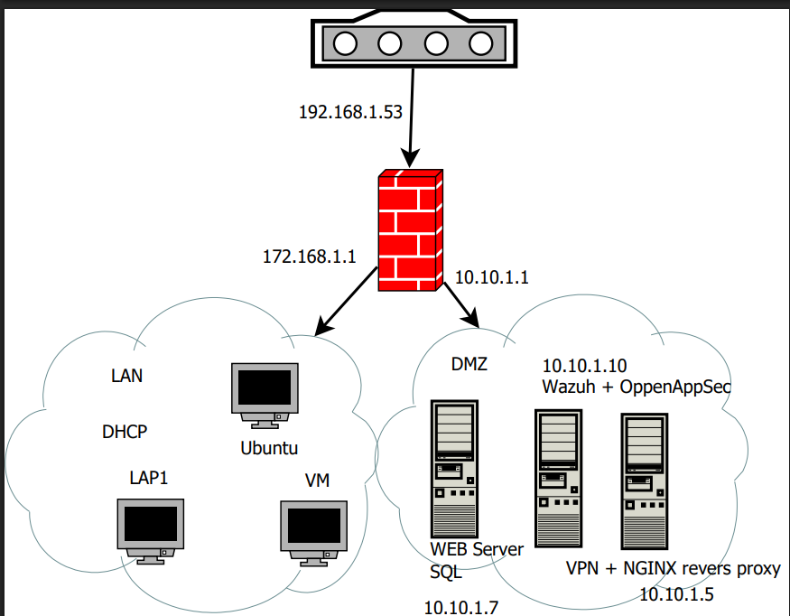

# Lab Architecture & Topology

## 1. Overview

This document details the network architecture, segmentation, routing, and component layout of the integrated Security Lab. The environment is engineered to simulate a realistic enterprise architecture featuring a perimeter firewall, internal LAN, a Demilitarized Zone (DMZ) for exposed services, and centralized monitoring via a Security Information and Event Management (SIEM) system.

---

## 2. Network Diagram & Segmentation

The lab is segmented into different subnetworks to enforce security boundaries, mirroring a typical corporate network topology managed by a core firewall.

---

## 3. Subnet & Addressing Scheme

| Zone / Segment | Subnet / Gateway | IP Address | Component / Host | Description |
| --- | --- | --- | --- | --- |
| **Perimeter / WAN** | `192.168.1.0/24` | `192.168.1.53` | Gateway / Upstream Router | Upstream connection to external network / host interface. |
| **Firewall (LAN)** | `172.168.1.0/24` | `172.168.1.1` | pfSense Firewall (LAN Interface) | Core routing, DHCP services, and internal traffic gateway. |
| **Firewall (DMZ)** | `10.10.1.0/24` | `10.10.1.1` | pfSense Firewall (DMZ Interface) | Perimeter isolation and traffic segmentation for exposed services. |
| **LAN (Internal)** | `172.168.1.0/24` | Dynamic (`172.168.1.X`) | Operator Workstation (LAP SIS) | Internal administrative network assigned dynamically via pfSense DHCP. |
| **DMZ (Services)** | `10.10.1.0/24` | `10.10.1.10` | Wazuh + OpenAppSec | Central SIEM platform, log collection, and application security. |
| **DMZ (Services)** | `10.10.1.0/24` | `10.10.1.7` | Web & Database Server | Public-facing Node.js web services and databases. |
| **DMZ (Services)** | `10.10.1.0/24` | `10.10.1.5` | VPN & NGINX Reverse Proxy | Secure perimeter ingress, SSL termination, and reverse proxy routing. |

---

## 4. Component Breakdown & Roles

### A. Perimeter & Routing

* **pfSense Firewall (`172.168.1.1` / `10.10.1.1`):** Acts as the central router, DHCP server for the LAN, and security gateway separating the internal network from the DMZ and external environments. Responsible for strict packet filtering, routing policies, and NAT rules.

### B. DMZ Zone (`10.10.1.0/24` - Core Focus)

* **Wazuh Manager + OpenAppSec (`10.10.1.10`):** Core SIEM platform handling real-time log collection, threat intelligence correlation, File Integrity Monitoring (FIM), command monitoring, and WAF rules.
* **Web & Database Server (`10.10.1.7`):** Houses internal/external web services (Node.js) and databases targeted during security evaluations.
* **VPN & NGINX Reverse Proxy (`10.10.1.5`):** Manages secure perimeter ingress, SSL/TLS termination, reverse proxy routing, and encrypted remote access tunnels into the lab architecture.

### C. LAN Zone (`172.168.1.0/24`)

* **Operator & Client Workstation (LAP SIS / Ubuntu / Host):** Internal workstations utilized for administrative tasks, testing, and simulating internal client interactions, receiving IP configurations dynamically through pfSense DHCP.

---

## 5. Security & Traffic Flow Policies

1. **Incoming Traffic & DMZ Isolation:** External requests hit the upstream router and are filtered through the pfSense firewall into the DMZ. Communication originating from the DMZ toward the internal LAN is strictly restricted and monitored to prevent lateral movement.
2. **Telemetry & Monitoring:** All critical system logs, custom rules, FIM triggers, and command executions across the DMZ components report back securely to the centralized Wazuh Manager (`10.10.1.10`).
